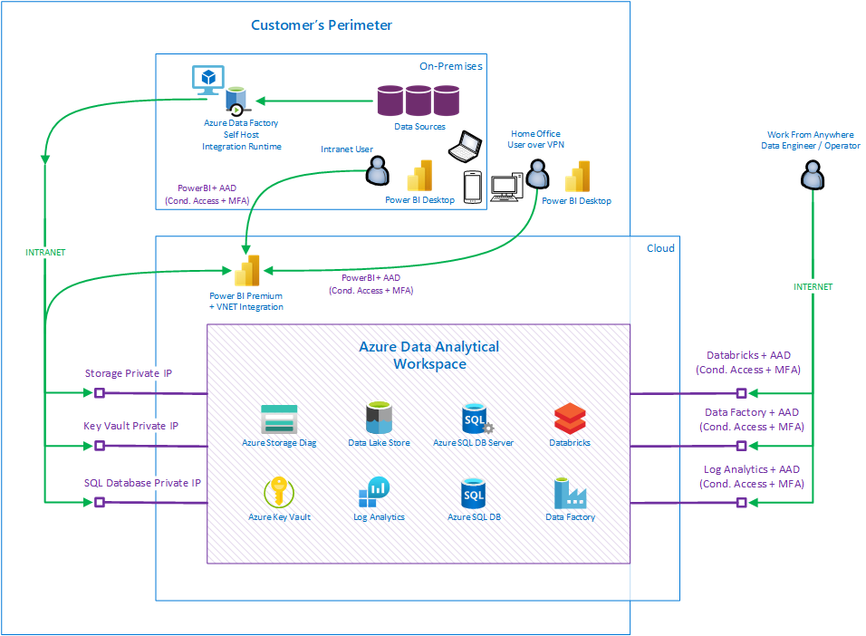

# Azure Data Analytical Workspace (ADAW) - Reference Architecture 2021 for Regulated Industries

## Project Overview

The goal of this project is to provide and document referential infrastructure architecture pattern,
guidance, explanations, and deployment resources/tools
to successfully deploy workspace for data analysis based on Azure services.

Focus is to provide the highest security level as this deployment pattern is
used in Highly Regulated Industries.

We are describing reusable pattern which can be further customized as each customer has different needs
and expectations. All resources are included inside this repository and we are open for feedback to further extend this pattern.

You can think about this guidance as Enterprise Ready plug-able
infrastructure building block for Data Analytics workloads compatible with Microsoft Best Practices for Landing Zones.

Data Analytical Workspace can be deployed multiple times in organization
for different teams, for different projects, for different environments (DEV, TEST, PROD, etc.).

Data Analytical Workspace can be deployed in automated way through provided scripts in cloud native way.
This provides consistent experience with focus on high quality security standards.
Approve once, deploy multiple times in the same secure way.

### Key Features

- Focus on Enterprise Grade Security standards
- Strong Support for Auditing, Monitoring and Diagnostics data
- Integrate and Keep network communication in perimeter where applicable
- Allow consumption of data sources inside perimeter, analyze data in cloud
- Benefit from Cloud Managed Services, reduce management and operations overhead
- Integrations with other cloud native tools - mainly Power Platform
- Protect and encrypt storage where potentially sensitive data are stored
- Protect keys and credentials in secure place

## Architecture Overview

Idea behind this pattern is based on following workflow.

Business Users needs to present, consume, slice and dice data in quick way on multiple devices.
Ideally on data model which is optimized (transformed) for data domain they are aligned to.

To achieve this, you typically need to get data in scalable way from multiple data sources in raw format (typically sitting on-prem),
store them in scalable way with potentially huge volumes. Store them to cheap storage in multiple versions and with history, clean data,
combine data Together, pre-aggregate data and store them again in structured way with indexing capability to provide speed for access.
You probably also want to mask data and secure/hide data which should not be seen by users from other geo regions or departments.

For that, you need to understand (propagate security context) who is viewing the data from reporting tool to structured storage
and ensure you are filtering data for target user based on role. (Role Based Access Control, Row Level Security).
You do not want to do it programmatically (like in WHERE clause), database engine should do it for you.

### Architecture in Azure components

Let's have a look how architecture described above can be translated into specific Azure services.

